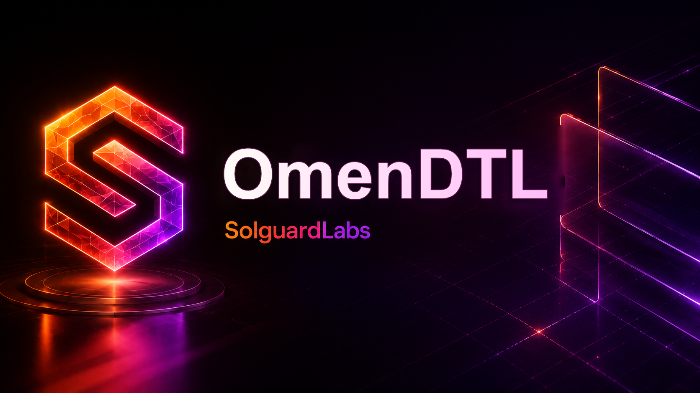

# OmenDTL



OmenDTL es un motor local de prediccion de liquidez escrito en Go. El sistema
preasigna reservas a rutas con demanda esperada, procesa actualizaciones de
demanda durante ventanas operativas y liquida reservas diferidas contra vaults
internos.

El binario no requiere servicios externos. Los tests TypeScript ejecutan la CLI
y validan el contrato JSON emitido por el motor.

## Componentes

- `src/amount.go`: cantidades enteras, buckets por asset y utilidades bps.
- `src/asset.go`: registro de activos, haircuts de forecast y fees.
- `src/account.go`: cuentas internas, balances y holds operativos.
- `src/vault.go`: vaults, buffers, liquidez libre, forecast y settlement.
- `src/route.go`: rutas de demanda, politicas y estado por mercado.
- `src/demand.go`: senales y actualizaciones de demanda.
- `src/forecast.go`: ventanas de forecast y compromisos por ruta.
- `src/reservation.go`: reservas preasignadas a rutas.
- `src/settlement.go`: lifecycle de settlements diferidos.
- `src/ledger.go`: estado central y transiciones economicas.
- `src/allocator.go`: construccion de batches de reserva.
- `src/planner.go`: vistas observadas, proyectadas y de drenaje.
- `src/risk.go`: invariantes y metricas de revision.
- `src/report.go`: salida JSON estable para tooling externo.
- `src/scenario.go`: escenarios deterministas de auditoria.
- `src/cli.go`: CLI `omendtl`.

## Requisitos

- Go 1.22 o superior.
- Node.js 24 o superior.

## Uso

Compilar:

```bash
node scripts/build.mjs
```

Listar escenarios:

```bash
out/omendtl --list
```

Ejecutar un escenario:

```bash
out/omendtl scenario operator-day
```

Validar invariantes de un escenario:

```bash
out/omendtl validate settlement
```

## Tests

```bash
npm test
```

La suite compila el binario y ejecuta:

```bash
node --test --experimental-strip-types "tests/node/*.test.ts"
```

Los escenarios publicos cubren:

- contrato CLI y salida JSON;
- ciclos de forecast;
- preasignacion de reservas;
- actualizaciones de demanda;
- liquidacion de reservas diferidas;
- ventanas de liquidez con withdrawals de tesoreria;
- ciclo operativo compuesto.

## CI

El workflow de GitHub Actions instala Go y Node.js y ejecuta:

```bash
bash scripts/ci.sh
```

El CI valida formato Go, `go vet`, `go test`, build del binario y tests
TypeScript.

## Estado Del Lab

OmenDTL esta disenado como un repositorio autocontenido de revision tecnica. La
salida JSON de la CLI es el contrato principal para tests de regresion,
analisis de escenarios y tooling de auditoria.

